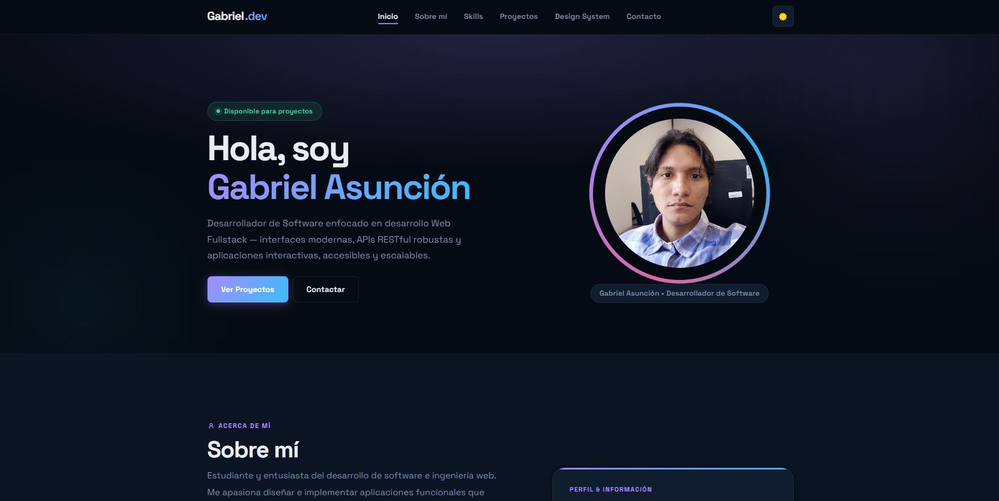
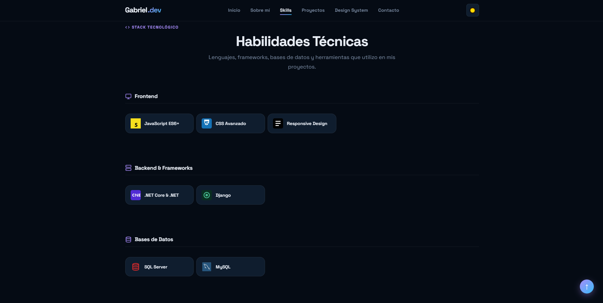
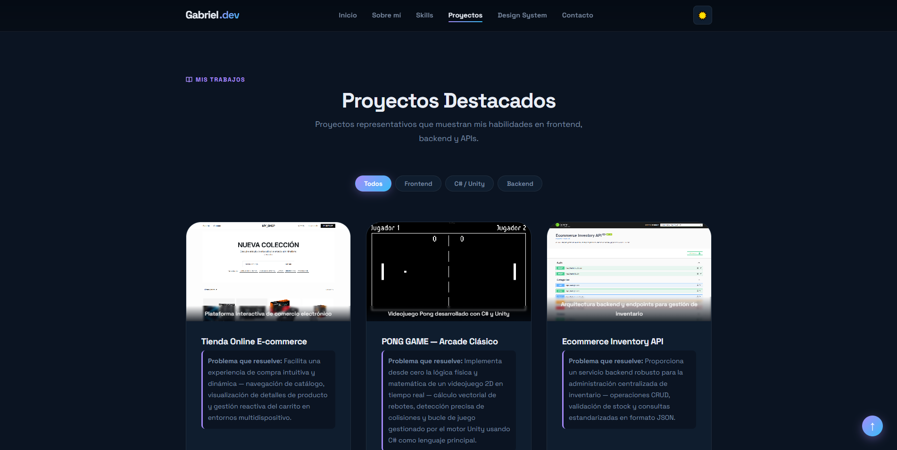

# Portafolio Profesional — Gabriel Asunción

Portafolio web moderno y profesional desarrollado con **HTML5 semántico**, **CSS3 puro con Custom Properties (Design System modular)** y **JavaScript Vanilla**, enfocado en buenas prácticas de arquitectura web, accesibilidad, diseño responsivo y rendimiento óptimo sin dependencias externas.

---

## 📸 Capturas del Resultado

A continuación se presentan capturas de pantalla de la interfaz desarrollada en modo oscuro:

### 1. Vista Principal (Hero Section)

*Encabezado con navegación interactiva, selector de tema claro/oscuro, badge de disponibilidad y avatar profesional con anillo degradado animado.*

### 2. Habilidades Técnicas

*Stack tecnológico categorizado en Frontend, Backend & Frameworks, Bases de Datos y Herramientas & Entornos con iconos representativos.*

### 3. Proyectos Destacados y Contacto

*Catálogo de proyectos con filtros interactivos por categoría (Todos, Frontend, C# / Unity, Backend), tarjetas con badges y formulario con validación en tiempo real.*

---

## 👤 Información del Desarrollador

- **Nombre:** Gabriel Asunción
- **Perfil:** Desarrollador de Software / Web Fullstack Junior
- **GitHub:** [gabriel-asuncion-20](https://github.com/gabriel-asuncion-20)
- **Especialidad:** JavaScript, Python, C#, Unity, .NET, HTML/CSS, PostgreSQL, SQL Server, MySQL, APIs REST, Antigravity y Git.

---

## 🛠️ Tecnologías Utilizadas

### Frontend
- **HTML5:** Estructura semántica completa (`<header>`, `<nav>`, `<main>`, `<section>`, `<article>`, `<figure>`, `<footer>`).
- **CSS3 Puro:** Custom Properties (Design Tokens), Flexbox, CSS Grid, animaciones (`@keyframes`), transiciones suaves y `clamp()` para tipografía fluida.
- **JavaScript Vanilla (ES6+):** Lógica interactiva nativa, manipulación del DOM, eventos y persistencia con Web Storage API.
- **Google Fonts:** Fuentes modernas *Space Grotesk* y *JetBrains Mono*.

### Backend & Frameworks
- **.NET Core & .NET:** Arquitectura de software y APIs robustas.
- **Django:** Framework backend en Python para aplicaciones escalables.
- **C# & Unity:** Programación orientada a objetos, lógica interactiva y desarrollo de videojuegos 2D/3D.

### Bases de Datos
- **SQL Server:** Consultas y administración de bases de datos relacionales empresariales.
- **MySQL:** Gestión relacional con MySQL Workbench.

### Herramientas & Entornos
- **Git & GitHub:** Control de versiones distribuido y despliegue continuo.
- **Visual Studio Code & Visual Studio Community:** Entornos de desarrollo integrados principales.
- **Antigravity:** Herramienta de productividad y desarrollo asistido por IA.

---

## 🚀 Proyectos Destacados

El portafolio incluye 3 proyectos representativos que demuestran capacidades en Frontend, Backend y programación de lógica interactiva:

### 1. Tienda Online E-commerce
* **Descripción:** Plataforma de comercio electrónico con catálogo dinámico de productos, vista previa de detalles, carrito de compras reactivo y diseño completamente adaptable a dispositivos móviles.
* **Problema que resuelve:** Facilita a los usuarios una experiencia de compra fluida e intuitiva, reduciendo la fricción al navegar inventarios y agregar artículos al carrito.
* **Tecnologías:** HTML5, CSS3, JavaScript (ES6+), Vercel.
* **Repositorio:** [gabriel-asuncion-20/Tienda-Online-Ecommerce](https://github.com/gabriel-asuncion-20/Tienda-Online-Ecommerce)
* **Proyecto Desplegado:** [prueba-proyecto-01-b9kw.vercel.app](https://prueba-proyecto-01-b9kw.vercel.app/)

### 2. Videojuego Clásico Pong (Arcade 2D)
* **Descripción:** Recreación del mítico videojuego arcade Pong implementado con **C# y Unity**.
* **Problema que resuelve:** Simula la física de rebotes vectoriales en 2D, control de aceleración de la pelota, detección de colisiones de paletas y bucle de renderizado interactivo estable a 60 FPS.
* **Tecnologías:** C#, Unity, Game Loop, 2D Physics.
* **Repositorio:** [gabriel-asuncion-20/PONG-GAME](https://github.com/gabriel-asuncion-20/PONG-GAME)

### 3. Ecommerce Inventory API
* **Descripción:** Servicio backend y API RESTful diseñada para la administración y control de inventarios, existencias de stock y catálogos de comercio electrónico.
* **Problema que resuelve:** Centraliza de forma segura la gestión de productos, permitiendo operaciones CRUD, validación de stock y respuestas estructuradas en formato JSON para aplicaciones cliente.
* **Tecnologías:** Node.js, Express, REST API, JSON, Postman.
* **Repositorio:** [gabriel-asuncion-20/Ecommerce-Inventory-Api](https://github.com/gabriel-asuncion-20/Ecommerce-Inventory-Api)

---

## 🎨 Design System y Arquitectura Visual

El proyecto implementa un sistema visual propio y documentado en `design-system.html`, basado en **CSS Custom Properties (Variables CSS)** para asegurar coherencia, escalabilidad y facilidad de mantenimiento:

### Tokens de Diseño (`css/root.css`)
* **Paleta de Colores:**
  * `--color-primary: #a78bfa` (Violeta moderno)
  * `--color-secondary: #38bdf8` (Cyan brillante)
  * `--color-accent: #f472b6` (Rosa acento)
  * `--color-bg: #050b14` (Fondo oscuro) / `#f8fafc` (Fondo claro)
  * `--color-surface: #0b1422` (Superficie oscura) / `#f1f5f9` (Superficie clara)
  * `--color-card: #0f1d2e` (Tarjetas oscuras) / `#ffffff` (Tarjetas claras)
  * `--color-text: #e8edf5` (Texto principal oscuro) / `#0f172a` (Texto claro)
  * `--color-text-muted: #7a8ba3` (Texto secundario)
* **Gradientes:**
  * `--gradient-primary: linear-gradient(135deg, #a78bfa 0%, #38bdf8 100%)`
  * `--gradient-accent: linear-gradient(135deg, #f472b6 0%, #a78bfa 100%)`
* **Escala de Espaciado Modular:**
  * `--space-xs: 0.25rem` (4px)
  * `--space-sm: 0.5rem` (8px)
  * `--space-md: 1rem` (16px)
  * `--space-lg: 2rem` (32px)
  * `--space-xl: 4rem` (64px)
  * `--space-2xl: 6rem` (96px)
  * `--space-3xl: 8rem` (128px)
* **Componentes Reutilizables Documentados:**
  * Botones (`.btn--primary`, `.btn--ghost`, `.btn--filter`)
  * Badges y etiquetas de tecnologías (`.badge`)
  * Skill cards interactivas (`.skill-card`)
  * Tarjetas de proyecto con elevación hover (`.card-project`)
  * Campos de formulario con estados de validación y accesibilidad (`.form-group`)
  * Barra de navegación fija con backdrop blur (`.header`)

---

## ⚡ Funcionalidades Interactivas (JavaScript)

El sitio implementa 5 funcionalidades interactivas con Vanilla JavaScript (`js/main.js`):

1. **Tema Claro / Oscuro con Persistencia:** Permite alternar entre el tema visual claro y oscuro, respetando las preferencias del sistema y almacenando la elección en `localStorage`.
2. **Menú de Navegación Responsive:** Botón tipo hamburguesa para pantallas táctiles y móviles, con cierre automático al seleccionar cualquier enlace.
3. **Filtro Dinámico de Proyectos:** Filtrado instantáneo por categoría (`Todos`, `Frontend`, `C# / Unity`, `Backend`) manipulando los atributos de datos y el DOM sin recargar la página.
4. **Validación de Formulario en Tiempo Real:** Verificación de campos obligatorios, validación de sintaxis de correo electrónico mediante expresiones regulares (Regex) y longitud mínima de mensaje con retroalimentación visual accesible.
5. **Botón Flotante "Volver Arriba":** Detección del scroll de la página para mostrar u ocultar suavemente el botón de regreso al encabezado.

---

## 📁 Estructura del Proyecto

El proyecto está organizado siguiendo una separación limpia de responsabilidades:

```text
portafolio-main/
│
├── index.html              # Portafolio principal con estructura semántica HTML5
├── design-system.html      # Página dedicada a la documentación del Design System
│
├── css/
│   ├── root.css            # Tokens de diseño, temas claro/oscuro y estilos globales
│   ├── index.css           # Estilos específicos de las secciones del portafolio
│   └── design-system.css   # Estilos exclusivos de la guía del Design System
│
├── js/
│   └── main.js             # Lógica interactiva modular en Vanilla JavaScript
│
├── img/
│   ├── foto gabriel.jpg    # Fotografía de perfil profesional
│   ├── p1.png              # Captura: Sección Hero del portafolio
│   ├── p2.png              # Captura: Sección Habilidades Técnicas
│   ├── p3.png              # Captura: Sección Proyectos y Contacto
│   ├── pro1.png            # Vista previa: Tienda Online E-commerce
│   ├── pro2.png            # Vista previa: Videojuego Pong
│   └── pro3.png            # Vista previa: Ecommerce Inventory API
│
└── README.md               # Documentación técnica completa del proyecto
```

---

## 💻 Instrucciones de Visualización Local

Para visualizar y probar el proyecto en tu computadora:

### Opción 1: Visualización directa en el navegador
1. Descarga o clona este repositorio en tu equipo:
   ```bash
   git clone https://github.com/gabriel-asuncion-20/Portafolio.git
   ```
2. Dirígete a la carpeta descargada.
3. Haz doble clic en `index.html` para abrir el portafolio en tu navegador web predeterminado (Google Chrome, Microsoft Edge, Mozilla Firefox, etc.).
4. Para ver la biblioteca de componentes y tokens, abre el archivo `design-system.html`.

### Opción 2: Servidor local con Live Server (Recomendado)
1. Abre la carpeta del proyecto en **Visual Studio Code**.
2. Instala la extensión **Live Server** (creada por *Ritwick Dey*).
3. Haz clic derecho sobre el archivo `index.html` y selecciona **Open with Live Server** (o presiona `Alt + L, Alt + O`).
4. El proyecto se abrirá en `http://127.0.0.1:5500/index.html` con recarga automática al guardar cambios.

---
